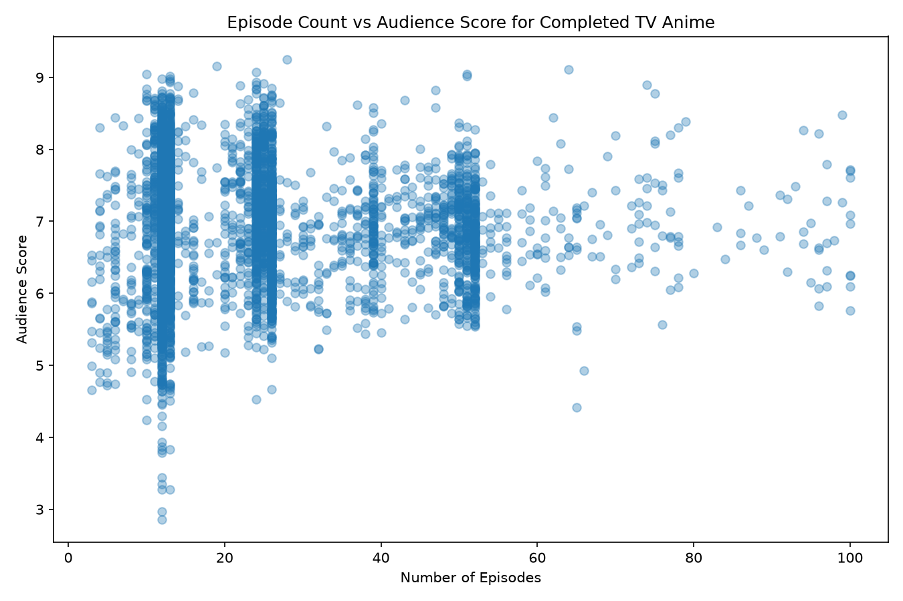

# Anime Length and Audience Rating

## Research Question

Is there a relationship between episode count and audience score among completed TV anime with 100 episodes or fewer?

## Data Source

This project uses a public anime dataset based on MyAnimeList data.

The dataset is available from the public GitHub repository:

[Anime Dataset on GitHub](https://github.com/meesvandongen/anime-dataset)

The raw CSV file is stored in:

`data/anime.csv`

The dataset contains information including anime title, media type, airing status, number of episodes, and audience score.

## Data Preparation

I selected only completed TV anime with valid episode counts and audience scores.

I also limited the final visualisation to anime with 100 episodes or fewer. In my first plot, a small number of extremely long-running anime stretched the x-axis to more than 2,000 episodes. This made most anime difficult to see, so I restricted the range to improve readability.

## Visualisation

The final visualisation is a scatter plot. The x-axis represents the number of episodes and the y-axis represents the audience score. Each point represents one anime.



## What the Picture Shows

The visualisation does not show a clear relationship where anime with more episodes consistently receive higher scores.

Anime with similar episode counts can have very different audience ratings. This suggests that episode count alone does not explain audience score.

## What the Picture Hides

The visualisation does not show genre, release year, popularity, studio, source material, or number of reviews.

It also excludes anime with more than 100 episodes. This improves the readability of the main distribution, but means that very long-running anime are not represented in the final picture.

## How to Run

Fetch the raw data:

```bash
uv run fetch.py